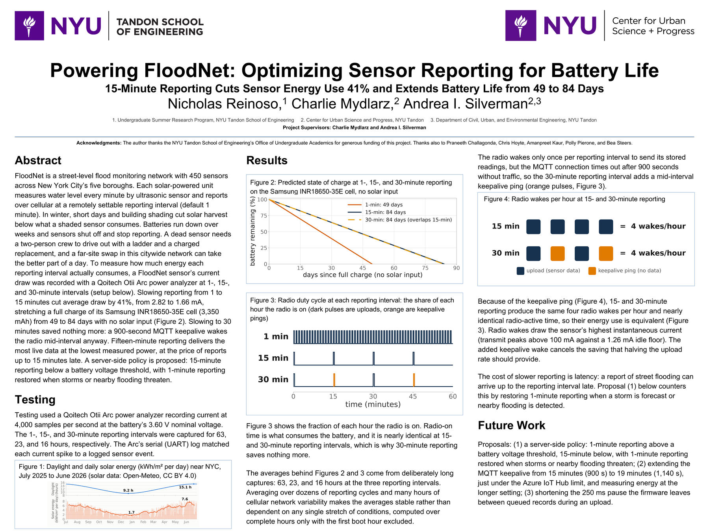
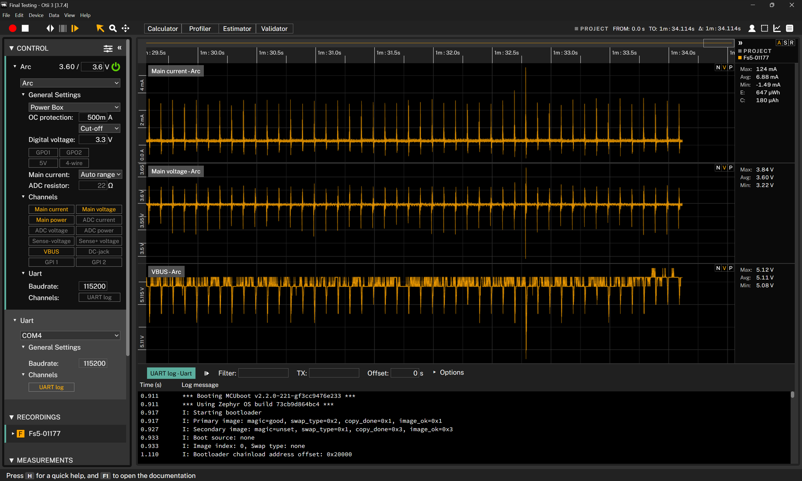
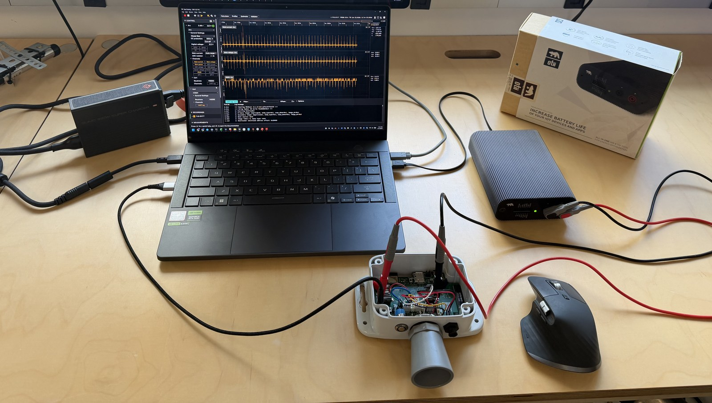

# floodnet-energy-cadence

[](poster/FloodNet_UGSRP_Poster_Final.png)

*Click the poster for the full-resolution PNG; the full-size PDF export (layout check) and the
PowerPoint source are in [`poster/`](poster/).*

## Abstract

"Powering FloodNet: Optimizing Sensor Reporting for Battery Life" (Nicholas Reinoso, Charlie
Mydlarz, Andrea I. Silverman; NYU Tandon UGSRP, 2026):

FloodNet operates 450 low-cost, solar-powered ultrasonic sensors that report street-level
flooding across New York City's five boroughs. Each sensor measures water level every minute
and transmits over cellular at a reporting interval that can be changed remotely, from every
minute (the default) up to every 30 minutes. In winter, shorter days and building shading cut
solar harvest at shaded sites below what a sensor consumes. Batteries run down over weeks and
sensors shut off and stop reporting, and each dead sensor needs a two-person crew driving
out with a ladder and a charged replacement, which for the farther sites in this citywide
network can take the better part of a day. To determine how much power slowing the reporting
rate actually saves, bench measurements were taken on an actual FloodNet sensor. It was
instrumented with a Qoitech Otii Arc
power analyzer at the battery's 3.60 V nominal voltage, recording current at 4,000 samples
per second across 1-, 15-, and 30-minute reporting intervals in 63-, 23-, and 16-hour
captures, long enough to average over dozens of reporting cycles and many hours of network
variability so the averages are stable. The analyzer's UART logging tied each current spike
to a logged firmware event.
Slowing reporting from 1 to 15 minutes cut average current draw by 41 percent, from 2.82 mA
to 1.66 mA, stretching a full charge of the sensor's Samsung INR18650-35E lithium-ion cell
from 49 to 84 days with no solar input. Slowing further to 30 minutes saved nothing
measurable, because the firmware's 900-second MQTT keepalive wakes the cellular modem halfway
through each 30-minute interval to keep its server connection alive: the radio wakes four
times per hour on either schedule. Fifteen-minute reporting therefore delivers the most live
data at the sensor's lowest measured power. The tradeoff is latency: at a slower rate, a
report can arrive up to the reporting interval late. A server-side reporting policy is
proposed, not yet deployed, to manage that tradeoff: sensors above a battery voltage
threshold keep 1-minute reporting, sensors
below it drop to 15 minutes, and a forecast storm or nearby flooding restores 1-minute
reporting so flood coverage is never compromised.

## Related records

The raw Otii recordings (11.6 GB) are deposited in NYU UltraViolet; the DOI link will be
added here once the record is published (deposit submitted 2026-08-09).
<!-- [DATA-DOI-PENDING] -->

The UGSRP 2026 program booklet containing this poster and abstract will be deposited in NYU
UltraViolet with its own DOI. The link will be added here once it is published.
<!-- [BOOKLET-DOI-PENDING] -->

## About this repository

Bench power measurements of a FloodNet flood sensor showing how the reporting interval controls
battery life: analysis scripts, poster figures, and data documentation.

## Result in one paragraph

[FloodNet](https://www.floodnet.nyc/) sensors report street flooding across New York City over
LTE-M cellular. Slowing a sensor's reporting from every minute to every 15 minutes cut its
average current draw by 41 percent, from 2.824 mA to 1.661 mA, stretching a full charge of its
3,350 mAh cell from 49 to 84 days with no solar input. Slowing further to 30 minutes saved
nothing measurable (1.668 mA), because the firmware's 900-second MQTT keepalive wakes the
cellular modem halfway through each 30-minute interval anyway: the radio wakes four times per
hour on either schedule. Fifteen-minute reporting therefore delivers the most live data at the
sensor's lowest measured power. The full proof chain for the headline number, with
uncertainties, is in [`docs/EVIDENCE_41_PERCENT.md`](docs/EVIDENCE_41_PERCENT.md).

## General information

- **Data collection:** 2026-07-31 to 2026-08-05, bench measurements of FloodNet node FS5-01177
  at NYU Tandon School of Engineering, Brooklyn, New York.
- **Funding:** NYU Tandon School of Engineering's Office of Undergraduate Academics
  (Undergraduate Summer Research Program).
- **Contact:** Nicholas Reinoso, NYU Tandon School of Engineering, n.reinoso@nyu.edu
- **AI assistance:** Analysis scripts, figure pipeline, and documentation were developed with
  AI assistance (Claude, Anthropic); all results were verified against the raw recordings.

## Repository contents

```
floodnet-energy-cadence/
  README.md                  this file
  LICENSE                    MIT (see Licensing below for scope)
  CITATION.cff               citation metadata
  requirements.txt           pinned Python dependencies
  poster/                    the poster: .pptx source, layout-check PDF, full-slide PNG
  abstract/                  the standalone extended abstract (Markdown)
  data/
    otii/                    raw Otii Arc recordings; NOT stored in the repo (11.6 GB,
                             largest file 3.6 GB); deposited in NYU UltraViolet. See
                             data/otii/README.md
    openmeteo/               the archived Open-Meteo API pull (JSON + manifest), the
                             derived daily CSV, and its provenance record
  scripts/                   Python scripts that regenerate every poster figure
                             (fig1..fig5), the recording census, and the Open-Meteo
                             fetch tool; plus the census output JSON
  figures/                   the five analysis figures, four of them on the poster (plus
                             fig1's derived CSV side output), regenerated by scripts/
  docs/                      EVIDENCE_41_PERCENT.md (proof chain for the headline claim),
                             OTII_RECORDING_NAMES.md (per-recording documentation), and
                             DATASHEET_VERIFICATION.md (battery datasheet verification)
  images/                    measurement-setup screenshot and photo, poster preview
```

The whole repository is about 10 MB without the raw data.

## Reproducing the figures

Requirements: Python 3.13 (3.11+ should work), then:

```
pip install -r requirements.txt
```

Each figure regenerates with one command from the repository root. File names keep the
original fig1 to fig5 numbering; since the 2026-08 poster revision the poster shows four
figures, where poster Figures 1 and 2 are fig1 and fig2's outputs, poster Figure 3 is
fig5_duty_cycle.py's output, poster Figure 4 is fig4_wakes_per_hour.py's output, and
fig3_report_cycles.py's report-cycle waveforms are no longer on the poster (kept here as
documentation of one full cycle at each schedule):

| Command | Output | Needs raw Otii data? | Approximate runtime |
|---|---|---|---|
| `py scripts/fig1_solar_season.py` | `figures/fig1_solar_season.png` | no (uses `data/openmeteo/`) | seconds |
| `py scripts/fig2_state_of_charge.py` | `figures/fig2_state_of_charge.png` | yes | seconds warm, minutes cold (reads 5.9 GB) |
| `py scripts/fig3_report_cycles.py` | `figures/fig3_report_cycles.png` | yes | seconds |
| `py scripts/fig4_wakes_per_hour.py` | `figures/fig4_wakes_per_hour.png` | yes | seconds warm, minutes cold (reads 2.3 GB) |
| `py scripts/fig5_duty_cycle.py` | `figures/fig5_duty_cycle.png` | yes | under a minute |
| `py scripts/otii_recording_census.py` | `scripts/otii_recording_census.json` | yes | minutes (reads all recordings) |

Two tiers, because the raw Otii captures exceed GitHub's file-size limits:

1. **Runs from a bare clone:** Figure 1, from the committed Open-Meteo data.
2. **Runs once you add the raw data:** Figures 2 through 5 and the census. Place the four Otii
   projects under `data/otii/` (see [`data/otii/README.md`](data/otii/README.md)) or set
   `FLOODNET_OTII_DATA` to the directory holding them.

Every script that computes a measured quantity carries a consistency gate: it derives the
value from the raw recordings at runtime and refuses to draw if the result stops matching the
poster. Expected values: steady-state means 2.824229 / 1.660821 / 1.668187 mA (1-, 15-,
30-minute), the 41.19 percent reduction, wake envelopes 19.9 / 23.1 / 26.4 / 19.7 s, the
keepalive offset at 15.2 minutes, and 4.00 wakes per hour at both batch schedules (30 uploads
plus 30 keepalives, exactly one keepalive per interval, in the 30-minute capture).

## Data documentation

### Otii Arc recordings (raw measurement data)

The raw Otii recordings (11.6 GB) are deposited in NYU UltraViolet; the DOI link will be
added here once the record is published (deposit submitted 2026-08-09).
<!-- [DATA-DOI-PENDING] -->

Fourteen recordings across four Otii projects: per-recording start times, durations, sample
counts, current statistics, UART-log contents, classifications (calibration vs live run), and
the naming scheme are documented in
[`docs/OTII_RECORDING_NAMES.md`](docs/OTII_RECORDING_NAMES.md). In brief: each experiment
project holds open-leads and sensor-off calibration checks around one long live capture
(62.8 h at 1-minute reporting, 23.4 h at 15-minute, 16.4 h at 30-minute), and a fourth project
holds a UART-correlated session covering all three schedules plus its rehearsal run. An
`.otii3` project stores each recording's channels as headerless little-endian float32 files
(current at 4,000 samples per second) mapped through the project's `project.json`; the UART
log is SQLite. `scripts/common_otii.py` implements the access layer, read-only.

### Open-Meteo solar data (Figure 1)

`data/openmeteo/` contains the exact archived API response used by the analysis
(`open_meteo_2025-07-01_2026-07-01.json`, with a manifest recording how and when it was
retrieved), the derived daily CSV, and the full provenance record
([`FIG1_PROVENANCE.md`](data/openmeteo/FIG1_PROVENANCE.md)). Two reproduction paths:

1. **Exact:** `fig1_solar_season.py` reads the committed JSON, the same bytes the poster
   figure was built from.
2. **Independent:** `py scripts/fetch_openmeteo_archive.py --lat 40.7381 --lon -74.0425
   --start 2025-07-01 --end 2026-07-01 --outdir openmeteo_refetch` re-downloads the same
   date range with a fresh provenance manifest into a separate directory. Do not point
   `--outdir` at `data/openmeteo`: the output filenames match the committed archival copy
   and would overwrite it. Refetched historical data can also differ slightly from the
   committed copy as the provider revises its archive.

Weather data by [Open-Meteo.com](https://open-meteo.com/), licensed
[CC BY 4.0](https://creativecommons.org/licenses/by/4.0/); the data was changed (hourly
shortwave radiation integrated to daily totals). Citation: Zippenfenig, P. (2023).
*Open-Meteo.com Weather API* [Computer software]. Zenodo.
https://doi.org/10.5281/ZENODO.7970649

### Battery datasheet (linked, not stored)

The battery model uses the Samsung SDI INR18650-35E specification v1.1 (2015-07-09): nominal
3.60 V, minimum standard discharge capacity 3,350 mAh. The datasheet is not redistributed
here; it is available at
[orbtronic.com/content/samsung-35e-datasheet-inr18650-35e.pdf](https://www.orbtronic.com/content/samsung-35e-datasheet-inr18650-35e.pdf).
The copy the analysis used was verified against that link; details in
[`docs/DATASHEET_VERIFICATION.md`](docs/DATASHEET_VERIFICATION.md).

## Measurement setup



Current was recorded with a Qoitech Otii Arc power analyzer supplying the sensor at the
battery's 3.60 V nominal voltage and sampling at 4,000 samples per second, with the
Arc's UART channel capturing the sensor's serial log time-synced to the current trace (the
screenshot shows a live capture: current, voltage, and VBUS panes above the UART log). The
1-, 15-, and 30-minute schedules were captured for 63, 23, and 16 hours, respectively. The
bench: sensor wired to the Otii Arc, Otii software on the laptop.



## Licensing

- **MIT** ([`LICENSE`](LICENSE)) covers the code and original content of this repository.
- The **Open-Meteo derived data** in `data/openmeteo/` remains under
  [CC BY 4.0](https://creativecommons.org/licenses/by/4.0/) with the attribution above.

## Citation

See [`CITATION.cff`](CITATION.cff). Project context: [floodnet.nyc](https://www.floodnet.nyc/).
